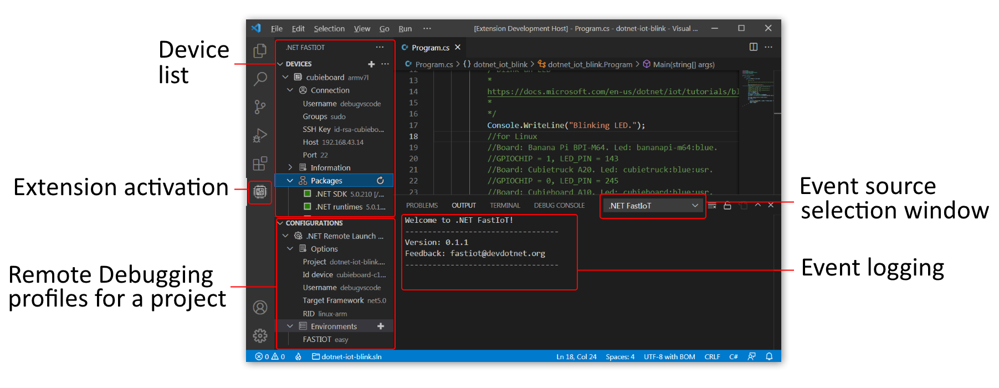

        

# .NET FastIoT VS Code Extension

[.NET FastIoT Extension](https://marketplace.visualstudio.com/items?itemName=devdotnetorg.vscode-extension-dotnet-fastiot ".NET FastIoT Extension") in Visual Studio Code Marketplace.

[README](README.md "README") in English | [README](README_ru.md "README") на русском языке | DevDotNet.ORG (Russian) - [latest news](https://devdotnet.org/tag/fastiot/ "devdotnet.org/tag/fastiot") | Habr.com (Russian) - [Easy development of IoT applications in C # for Raspberry Pi and other SBCs, on Linux](https://habr.com/ru/company/timeweb/blog/597601/ "Easy development of IoT applications in C # for Raspberry Pi and other SBCs, on Linux").

This extension allows you configures an ARMv7 or ARMv8 Linux embedded device to run .NET applications, and configures `*.csproj` projects for remote debugging via an ssh-tunnel. This has been tested on Windows (64 bits).

Devices supported: Raspberry Pi, Banana Pi, Orange Pi, Radxa, Tinkerboard, Odroid, Khadas VIM, NanoPi, Pine.

*.NET FastIoT Extension UI*

## Features

1. Easy installation of .NET SDK, .NET Runtimes, .NET Debugger (vsdbg), Libgpiod libraries, Docker for Linux;
2. Creating a project from a ready-made template with the possibility of remote debugging;
3. Setting up existing projects on .NET for remote debugging;
4. Creation of custom project templates and remote debugging configuration;
5. Managing device overlay files (Device Tree overlays). Required to enable/disable devices such as I2C, SPI, PWM, etc. More details in the publication [Working with GPIO. Part 2. Device Tree overlays](https://devdotnet.org/post/rabota-s-gpio-na-primere-banana-pi-bpi-m64-chast-2-device-tree-overlays/ "Working with GPIO . Part 2. Device Tree overlays").

## System requirements

- **OS version.** Windows 7-10 (x64). A Linux version will come later. Note: The next version of the extension above v0.3 will not support Windows 7;
- **Visual Studio Code.** version not lower than [1.70.3](https://code.visualstudio.com/ "1.70.3"). This is the latest version of VSCode with Windows 7 support, more details on this on [support page](https://code.visualstudio.com/docs/supporting/faq#_can-i-run-vs-code-on-windows-7 "Can I run VS Code on Windows 7?");
- **.NET.** Compiling a C# project requires [.NET SDK](https://dotnet.microsoft.com/en-us/download/visual-studio-sdks ".NET SDK") depending on the version of your project you are using (the extension itself is not required to work);

Additional extensions required for developing .NET applications:

- [C# for Visual Studio Code (powered by OmniSharp)](https://marketplace.visualstudio.com/items?itemName=ms-dotnettools.csharp "C# for Visual Studio Code (powered by OmniSharp)") - development support for C#.

Recommended additional extensions that improve the development process and interaction with the remote device:

- [NuGet Package Manager GUI](https://marketplace.visualstudio.com/items?itemName=aliasadidev.nugetpackagemanagergui "NuGet Package Manager GUI") - adding Nuget packages (later the Nuget package manager will be built into the extension);
- [DeviceTree](https://marketplace.visualstudio.com/items?itemName=plorefice.devicetree "DeviceTree") - Syntax support for Device Tree (DT) files. Used to edit `*.dts` files. For example, it will be necessary if it becomes necessary to adapt the [SPI LCD ILI9341 display](https://devdotnet.org/post/rabota-s-gpio-v-linux-na-primere-banana-pi-bpi-m64-chast-4-device-tree-overlays-podkluchenie-displey-spi-lcd-ili9341/ "SPI LCD ILI9341 display") for your SBC;
- [Output Colorizer](https://marketplace.visualstudio.com/items?itemName=IBM.output-colorizer "Output Colorizer") - adds color to the test messages in the OUTPUT window, makes it easier to perceive the information provided by the extension.

## System requirements for the device

- **Processor.** ARMv7 or ARMv8;
- **OS version.** Linux distribution based on Ubuntu 20.04 LTS or later (Focal Fossa), or Debian 10.11 or later (Buster). It is recommended to use the distribution kit [Armbian](https://www.armbian.com/ "Armbian - Linux for ARM development boards").

## Getting started

See [Getting started](/docs/Getting-started.md "Getting started").

## Extension settings

See [Extension settings](/docs/Extension-settings.md "Extension settings").

## Troubleshooting

For troubleshooting, see the [Troubleshooting](docs/Troubleshooting.md "Troubleshooting") guide.

## Project Templates

How to create templates visit the page [Project Templates](docs/Project-templates.md "Project Templates").

## Additional materials

For additional documentation for the project, visit the [Additional materials](docs/Additional-materials.md "Additional materials") page.

## Changelog

See [CHANGELOG](CHANGELOG.md "CHANGELOG").

## License

This software is licensed under the LGPL-3.0.

See [LICENSE](LICENSE "LICENSE") for details.

[Project Templates](/templates/ "Project Templates") for projects are distributed under the license [MIT](LICENSE_MIT.md "MIT LICENSE").

## Feedback

Send your comments to `fastiot@devdotnet.org`. And check in [Issues](https://github.com/devdotnetorg/vscode-extension-dotnet-fastiot/issues "Issues").

## Schedule

See [SCHEDULE](SCHEDULE.md "SCHEDULE").

## Known Issues

See [ISSUES](ISSUES.md "ISSUES") and [Issues on GitHub](https://github.com/devdotnetorg/vscode-extension-dotnet-fastiot/issues "Issues on GitHub").

## Testing

Testing was performed on single-board computers:

- [Cubieboard](https://github.com/devdotnetorg/Cubieboard "Cubieboard"). Armbian distribution.
- [Cubietruck](https://devdotnet.org/post/otladochnaya-plata-cubietruck/ "Cubietruck"). Armbian distribution.
- [Banana Pi BPI-M64](https://devdotnet.org/post/otladochnaya-plata-banana-pi-bpi-m64/ "Banana Pi BPI-M64"). Armbian distribution.
