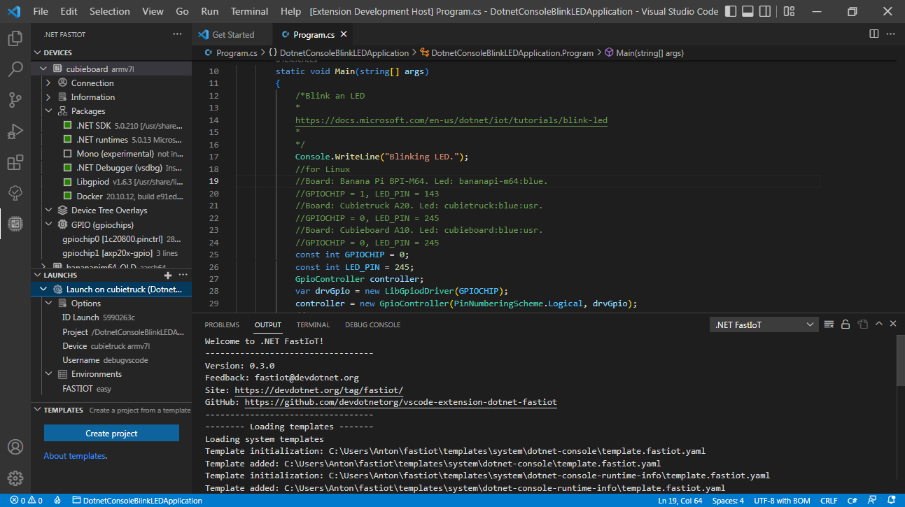
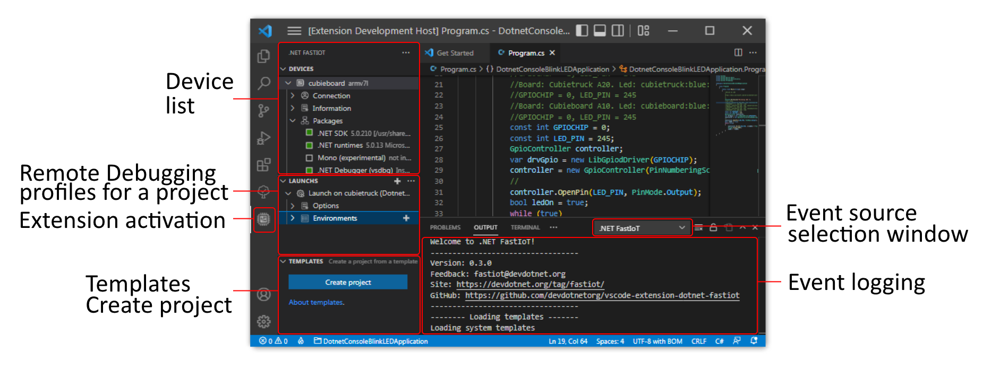
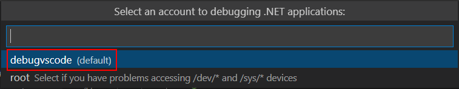
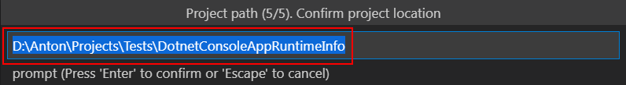

[](LICENSE) [](https://github.com/devdotnetorg/vscode-extension-dotnet-fastiot/) [](https://github.com/devdotnetorg/vscode-extension-dotnet-fastiot/issues) [](https://marketplace.visualstudio.com/items?itemName=devdotnetorg.vscode-extension-dotnet-fastiot) [](https://marketplace.visualstudio.com/items?itemName=devdotnetorg.vscode-extension-dotnet-fastiot) [](https://marketplace.visualstudio.com/items?itemName=devdotnetorg.vscode-extension-dotnet-fastiot)

# .NET FastIoT VS Code Extension

Extension [.NET FastIoT](https://marketplace.visualstudio.com/items?itemName=devdotnetorg.vscode-extension-dotnet-fastiot ".NET FastIoT Extension") in Visual Studio Code Marketplace.

[README](README.md "README") in English | [README](README_ru.md "README") на русском языке | DevDotNet.ORG (Russian) - [latest news](https://devdotnet.org/tag/fastiot/ "devdotnet.org/tag/fastiot") | Habr.com (Russian) - [Easy development of IoT applications in C # for Raspberry Pi and other SBCs, on Linux](https://habr.com/ru/company/timeweb/blog/597601/ "Easy development of IoT applications in C # for Raspberry Pi and other SBCs, on Linux").

This extension allows you configures an ARMv7 or ARMv8 Linux embedded device to run .NET applications, and configures `*.csproj` projects for remote debugging via an ssh-tunnel. This has been tested on Windows (64 bits).

Devices supported: Raspberry Pi, Banana Pi, Orange Pi, Radxa, Tinkerboard, Odroid, Khadas VIM, NanoPi, Pine.

*.NET FastIoT Extension UI*





## Features

1. Easy installation of .NET SDK, .NET Runtimes, .NET Debugger (vsdbg), Libgpiod libraries, Docker for Linux;
2. Creating a project from a ready-made template with the possibility of remote debugging;
3. Setting up existing projects on .NET for remote debugging;
4. Creation of custom project templates and remote debugging configuration;
5. Managing device overlay files (Device Tree overlays). Required to enable/disable devices such as I2C, SPI, PWM, etc. More details in the publication [Working with GPIO. Part 2. Device Tree overlays](https://devdotnet.org/post/rabota-s-gpio-na-primere-banana-pi-bpi-m64-chast-2-device-tree-overlays/ "Working with GPIO . Part 2. Device Tree overlays").

## System requirements

- **OS version.** Windows 7-10 (x64). A Linux version will come later. Note: The next version of the extension above v0.3 will not support Windows 7;
- **Visual Studio Code.** version not lower than [1.70.3](https://code.visualstudio.com/ "1.70.3"). This is the latest version of VSCode with Windows 7 support, more details on this on [support page](https://code.visualstudio.com/docs/supporting/faq#_can-i-run-vs-code-on-windows-7 "Can I run VS Code on Windows 7?");
- **.NET.** Compiling a C# project requires [.NET SDK](https://dotnet.microsoft.com/en-us/download/visual-studio-sdks ".NET SDK") depending on the version of your project you are using (the extension itself is not required to work);

Additional extensions required for developing .NET applications:

- [C# for Visual Studio Code (powered by OmniSharp)](https://marketplace.visualstudio.com/items?itemName=ms-dotnettools.csharp "C# for Visual Studio Code (powered by OmniSharp)") - development support for C#.

Recommended additional extensions that improve the development process and interaction with the remote device:

- [NuGet Package Manager](https://marketplace.visualstudio.com/items?itemName=jmrog.vscode-nuget-package-manager "NuGet Package Manager") - adding Nuget packages (later the Nuget package manager will be built into extension);
- [DeviceTree](https://marketplace.visualstudio.com/items?itemName=plorefice.devicetree "DeviceTree") - Syntax support for Device Tree (DT) files. Used to edit `*.dts` files. For example, it will be necessary if it becomes necessary to adapt the [SPI LCD ILI9341 display](https://devdotnet.org/post/rabota-s-gpio-v-linux-na-primere-banana-pi-bpi-m64-chast-4-device-tree-overlays-podkluchenie-displey-spi-lcd-ili9341/ "SPI LCD ILI9341 display") for your SBC;
- [Output Colorizer](https://marketplace.visualstudio.com/items?itemName=IBM.output-colorizer "Output Colorizer") - adds color to the test messages in the OUTPUT window, makes it easier to perceive the information provided by the extension.

## System requirements for the device

- **Processor.** ARMv7 or ARMv8;
- **OS version.** Linux distribution based on Ubuntu 20.04 LTS or later (Focal Fossa), or Debian 10.11 or later (Buster). It is recommended to use the distribution kit [Armbian](https://www.armbian.com/ "Armbian - Linux for ARM development boards").

## Getting started

### Step 1 — Preparing the device

The single board computer must be running a Debian or Ubuntu, Linux distribution. For remote access, you need to install the [OpenSSH](https://ubuntu.com/server/docs/service-openssh "Service - OpenSSH Ubuntu") server and set certain settings. You can use [MobaXterm](https://mobaxterm.mobatek.net/download.html "MobaXterm Xserver with SSH, telnet, RDP, VNC and X11") as a remote access terminal. All subsequent steps are performed on a single-board computer.

1. If the `sudo` package is not installed, then install this package as the `root` user using the commands:

```bash
apt-get update
apt-get install -y sudo
```

2. To install the OpenSSH server and configure access, run the following commands:

```bash
sudo apt-get update
sudo apt-get install -y openssh-server mc
sudo systemctl reload ssh
sudo systemctl status ssh
sudo mcedit /etc/ssh/sshd_config
```

3. In the opened editor, set the following parameters:

```bash
PermitRootLogin yes
PasswordAuthentication yes
```

The remaining necessary parameters will be added automatically when you first connect to the device using the extension.

4. Then save the changes <kbd>F2</kbd> and exit the editor <kbd>F10</kbd>.

5. Restart the OpenSSH server to apply the new settings:

```bash
sudo systemctl reload ssh
sudo systemctl status ssh
```

The last command displays the current status of the service.

### Step 2 - Adding a Device

*Add device*


All settings, including private keys, templates, are by default located in the user profile folder along the path `%userprofile%\fastiot` (the location can be changed in the settings). When you connect to the device for the first time, a pair of keys is created: private and public. The private key is copied to the `%userprofile%\fastiot\settings\keys` folder and used to configure the device and start remote debugging, the public key is stored on the remote device itself.

The important point is to select an account to create on the device that will be used for device management and remote debugging. The first option is the **debugvscode** account (the name can be changed in the settings), the second option is **root**:

*Selecting an account to create on the device*



Selecting the **debugvscode** option creates a configuration file for device access rights [20-gpio-fastiot.rules](/linux/config/20-gpio-fastiot.rules "20-gpio-fastiot.rules") using the [ udev](https://ru.wikipedia.org/wiki/Udev "udev"). A group named **iot** is created and the user **debugvscode** is added to it. The **iot** group is then given permissions to gpiochip, led, and pwm. Further, to access other hardware interfaces, the user **debugvscode** is added to the appropriate groups with access such as: video, i2c, spi, spidev, kmem, tty, dialout, input, audio, to access I2C, SPI, etc. d.

Due to the fact that testing was performed only on [Armbian](https://www.armbian.com/ "Armbian - Linux for ARM development boards"), not all permissions may have been added. Therefore, if there are problems with access rights to gpiochip, PWM, etc., then choose - ** root **.

### Step 3 - Install Packages

To run a .NET IoT application and perform remote debugging, you need to install:

- Runtime - .NET Runtime;
- Remote debugger - .NET Debugger (vsdbg).

*Minimum set of packages to run .NET applications*


### Step 4 - Create a Project

1. Now you need to create a project. To create a project, click on the *Create project* button:


2. Select a device for remote debugging:


3. Select a template for the project:


4. Set the name of the project:


5. Specify the folder for saving the project:



6. Select version of .NET framework:


7. Available Launch to launch remote debugging:


8. Now go to `Run and Debug`:


9. Select the Launch configuration to launch:


10. Run the project for debugging menu `Run > Start Debugging`:


11. An example of displaying messages during remote debugging:


Sample projects with added configuration Launch (`/.vscode/launch.json`) and Tasks (`/.vscode/tasks.json`) are located in the [samples](/samples/) folder.

## Rebuild Launch

Launch (`/.vscode/launch.json`) and Tasks (`/.vscode/tasks.json`) configurations contain absolute paths to binary files that are loaded on the device, for example `/cygdrive/d/Anton/Projects/Tests /DotnetConsoleAppRuntimeInfo/bin/Debug/net5.0/linux-arm/`. In this regard, if you change the path to the `Applicationdatafolder` folder in the settings or rename / move the project folder, then the paths become non-existent. In this case, you need to rebuild (Rebuild) Launch. Select the required Launch and then call the context menu, click on the `Rebuild` menu item.

*Invoking the Rebuild command*


## Extension settings

To change the extension settings, open the menu item `File > Preferences > Settings`. Then go to the `User` tab and select `Extensions`.


Settings:

- **Fastiot › Device › Account: Groups** - Linux user group on a remote device (eg Raspberry Pi) to which an account (`debugvscode`) will be added to manage the device. This group must have Administrator rights. Default value: `sudo`.
- **Fastiot › Device › Account: Username** - account name, created on the remote device. Used to control the device and perform remote debugging. Default value: `debugvscode`.
- **Fastiot › Device › All: JSON** - device settings in JSON format, it is not recommended to change them manually. Due to incorrect changes, the device list may not load.
- **Fastiot › Device: Applicationdatafolder** - a shared folder for storing access keys to devices (for example, Raspberry Pi), templates, extension settings. Default value: `%userprofile%\fastiot`. Example: `C:\Users\Anton\fastiot`.
- **Fastiot › Device > ssh > Key: Bits** - key length in bits. Default value: `256`.
- **Fastiot › Device > ssh > Key: Type** - The name of the algorithm used to generate the key. For more information about key algorithms, see [How To Set Up SSH Keys](https://goteleport.com/blog/how-to-set-up-ssh-keys/). Default value: `ed25519`. If you choose the `rsa` algorithm, then you will need to add the line `PubkeyAcceptedAlgorithms=+ssh-rsa` to the `/etc/ssh/sshd_config` file.
- **Fastiot › Launch: Templatetitle** - template for forming the name of Launch. Variable values can be viewed at [link](docs/Launch-title-template.md "Template for forming the name Launch"). Default value: `Launch on %{device.label} (%{project.name}, %{device.board.name}, %{device.user.debug})`.

## Troubleshooting

For troubleshooting, see the [Troubleshooting](docs/Troubleshooting.md "Troubleshooting") guide.

## Project Templates

How to create templates visit the page [Project Templates](docs/Project-templates.md "Project Templates").

## Additional materials

For additional documentation for the project, visit the [Additional materials](docs/Additional-materials.md "Additional materials") page.

## Changelog

See [CHANGELOG](CHANGELOG.md "CHANGELOG").

## License

This software is licensed under the LGPL-3.0.

See [LICENSE](LICENSE "LICENSE") for details.

[Project Templates](/templates/ "Project Templates") for projects are distributed under the license [MIT](LICENSE_MIT.md "MIT LICENSE").

## Feedback

Send your comments to `fastiot@devdotnet.org`. And check in [Issues](https://github.com/devdotnetorg/vscode-extension-dotnet-fastiot/issues "Issues").

## Schedule

See [SCHEDULE](SCHEDULE.md "SCHEDULE").

## Known Issues

See [ISSUES](ISSUES.md "ISSUES") and [Issues on GitHub](https://github.com/devdotnetorg/vscode-extension-dotnet-fastiot/issues "Issues on GitHub").

## Testing

Testing was performed on single-board computers:

- [Cubieboard](https://github.com/devdotnetorg/Cubieboard "Cubieboard")
- [Cubietruck](https://devdotnet.org/post/otladochnaya-plata-cubietruck/ "Cubietruck")
- [Banana Pi BPI-M64](https://devdotnet.org/post/otladochnaya-plata-banana-pi-bpi-m64/ "Banana Pi BPI-M64")
