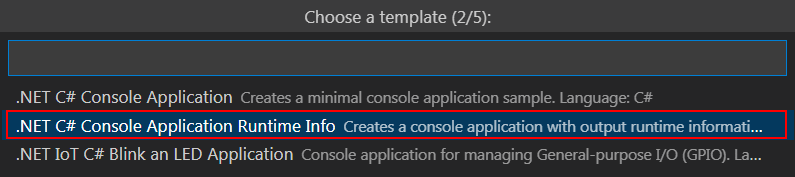

[](LICENSE) [](https://github.com/devdotnetorg/vscode-extension-dotnet-fastiot/) [](https://github.com/devdotnetorg/vscode-extension-dotnet-fastiot/issues) [](https://marketplace.visualstudio.com/items?itemName=devdotnetorg.vscode-extension-dotnet-fastiot) [](https://marketplace.visualstudio.com/items?itemName=devdotnetorg.vscode-extension-dotnet-fastiot) [](https://marketplace.visualstudio.com/items?itemName=devdotnetorg.vscode-extension-dotnet-fastiot)

# .NET FastIoT VS Code Extension

Расширение [.NET FastIoT](https://marketplace.visualstudio.com/items?itemName=devdotnetorg.vscode-extension-dotnet-fastiot ".NET FastIoT Extension") в Visual Studio Code Marketplace.

[README](README.md "README") in English | [README](README_ru.md "README") на русском языке | DevDotNet.ORG (Russian) - [последние новости](https://devdotnet.org/tag/fastiot/ "devdotnet.org/tag/fastiot") | Habr.com (Russian) - [Простая разработка IoT приложений на C# для Raspberry Pi и других одноплатников, на Linux](https://habr.com/ru/company/timeweb/blog/597601/ "Простая разработка IoT приложений на C# для Raspberry Pi и других одноплатников, на Linux").

Расширение настраивает встраиваемое устройство на архитектуре ARMv7 или ARMv8, работающее под Linux, для запуска .NET приложений, и конфигурирует проекты `*.csproj` для удаленной отладки по ssh-туннелю. Работает только на Windows (64 бит).

Поддерживаются устройства: Raspberry Pi, Banana Pi, Orange Pi, Radxa, Tinkerboard, Odroid, Khadas VIM, NanoPi, Pine.

*Интерфейс расширения .NET FastIoT*


## Возможности

1. Простая установка .NET SDK, .NET Runtimes, .NET Debugger (vsdbg), библиотеки Libgpiod, Docker для Linux;
2. Создание проекта из готового шаблона с возможностью удаленной отладки;
3. Настройка уже существующих проектов на .NET для удаленной отладки;
4. Создание пользовательских шаблонов проектов и конфигурации удаленной отладки;
5. Управление файлами наложения устройств (Device Tree overlays). Требуется для включения/выключения таких устройства как I2C, SPI, PWM, и т. д. Более подробно в публикации [Работа с GPIO. Часть 2. Device Tree overlays](https://devdotnet.org/post/rabota-s-gpio-na-primere-banana-pi-bpi-m64-chast-2-device-tree-overlays/ "Работа с GPIO. Часть 2. Device Tree overlays").

## Системные требования

- **Версия ОС.** Windows 7-10 (x64). Версия для Linux появится позже. Примечание: следующая версия расширения выше v0.3 не будет поддерживать Windows 7;
- **Visual Studio Code.** версия не ниже [1.70.3](https://code.visualstudio.com/ "1.70.3"). Это последняя версия VSCode с поддержкой Windows 7, подробнее об этом на [странице поддержки](https://code.visualstudio.com/docs/supporting/faq#_can-i-run-vs-code-on-windows-7 "Can I run VS Code on Windows 7?");
- **.NET.** Для компиляции проекта на C# требуется [.NET SDK](https://dotnet.microsoft.com/en-us/download/visual-studio-sdks ".NET SDK") в зависимости от используемой версии вашего проекта (для работы самого расширения не требуется);

Дополнительные расширения необходимые для разработки .NET приложений:

- [C# for Visual Studio Code (powered by OmniSharp)](https://marketplace.visualstudio.com/items?itemName=ms-dotnettools.csharp "C# for Visual Studio Code (powered by OmniSharp)") — поддержка разработки на C#.

Рекомендуемые дополнительные расширения улучшающие процесс разработки и взаимодействия с удаленным устройством:

- [NuGet Package Manager](https://marketplace.visualstudio.com/items?itemName=jmrog.vscode-nuget-package-manager "NuGet Package Manager") — добавление Nuget-пакетов (позже менеджер Nuget-пакетов будет встроен в расширение);
- [DeviceTree](https://marketplace.visualstudio.com/items?itemName=plorefice.devicetree "DeviceTree") — поддержка синтаксиса для файлов дерева устройств (Device Tree, DT). Используется для редактирования файлов `*.dts`. Например, потребуется если возникнет необходимость адаптации [дисплея SPI LCD ILI9341](https://devdotnet.org/post/rabota-s-gpio-v-linux-na-primere-banana-pi-bpi-m64-chast-4-device-tree-overlays-podkluchenie-displey-spi-lcd-ili9341/ "дисплея SPI LCD ILI9341") для вашего одноплатного компьютера;
- [Output Colorizer](https://marketplace.visualstudio.com/items?itemName=IBM.output-colorizer "Output Colorizer") — добавляет цвет к тестовым сообщениям в окне OUTPUT, облегчает восприятие информации выдаваемой расширением.

## Системные требования для устройства

- **Процессор.** ARMv7 или ARMv8;
- **Версия ОС.** Linux дистрибутив построенный на основе Ubuntu версии не ниже 20.04 LTS (Focal Fossa), или на основе Debian версии не ниже 10.11 (Buster). Рекомендуется использовать дистрибутив [Armbian](https://www.armbian.com/ "Armbian – Linux for ARM development boards").

## Быстрый старт

### Шаг 1 — Подготовка устройства

Одноплатный компьютер должен работать под управлением дистрибутива Debian или Ubuntu, Linux. Для удаленного доступа необходимо установить [OpenSSH](https://ubuntu.com/server/docs/service-openssh "Service - OpenSSH Ubuntu") сервер и задать определенные настройки. В качестве терминала для удаленного доступа можно использовать [MobaXterm](https://mobaxterm.mobatek.net/download.html "MobaXterm Xserver with SSH, telnet, RDP, VNC and X11"). Все последующие действия выполняются на одноплатном компьютере.

1. Если пакет `sudo` не установлен, то установите данный пакет от имени пользователя `root`, с помощью команд:

```bash
apt-get update
apt-get install -y sudo
```

2. Для установки OpenSSH сервера и настройки доступа выполните следующие команды:

```bash
sudo apt-get update
sudo apt-get install -y openssh-server mc
sudo systemctl reload ssh
sudo systemctl status ssh
sudo mcedit /etc/ssh/sshd_config
```

3. В открывшемся редакторе задайте следующие параметры:

```bash
PermitRootLogin yes
PasswordAuthentication yes
```

Остальные необходимые параметры будут добавлены автоматически при первом подключении к устройству используя расширение.

4. Затем сохраните изменения <kbd>F2</kbd> и выйдите  из редактора <kbd>F10</kbd>.

5. Перезапустите OpenSSH сервер для применения новых настроек:

```bash
sudo systemctl reload ssh
sudo systemctl status ssh
```

Последняя команда выводит текущий статус службы.

### Шаг 2 — Добавление устройства

*Добавление устройства*


Все настройки включая приватные ключи, шаблоны, по умолчанию располагаются в папке профиля пользователя по пути `%userprofile%\fastiot` (расположение можно изменить в настройках). При первом подключении к устройству создается пара ключей, приватный и публичный. Приватный ключ копируется в папку `%userprofile%\fastiot\settings\keys` и используется для конфигурирования устройства и запуска удаленной отладки, публичный ключ хранится на самом удаленном устройстве.

Важный момент заключается в выборе учетной записи для создания на устройстве, которая будет использоваться для управления устройством и удаленной отладки. Первый вариант это учетная запись **debugvscode** (название можно изменить в настройках), второй вариант это **root**:

*Выбор учетной записи для создания на устройстве*


При выборе варианта **debugvscode** создаетcя файл настройки прав доступа [20-gpio-fastiot.rules](/linux/config/20-gpio-fastiot.rules "20-gpio-fastiot.rules") к устройствам используя подсистему [udev](https://ru.wikipedia.org/wiki/Udev "udev"). Создается группа с названием **iot**, и в нее добавляется пользователь **debugvscode**. Затем группе **iot** выдаются права доступа к gpiochip, led и pwm. Далее для доступа к другим аппаратным интерфесам пользователь **debugvscode** добавляется в соответствующие группы с доступом такие как: video, i2c, spi, spidev, kmem, tty, dialout, input, audio, для доступа к I2C, SPI, и т.д. 

В связи с тем, что тестирование выполнялось только на [Armbian](https://www.armbian.com/ "Armbian – Linux for ARM development boards"), возможно не все права доступа были добавлены. Поэтому, если возникнут проблемы с правами доступа к gpiochip, PWM и т.д., то выбирайте — **root**.

### Шаг 3 — Установка пакетов

Для запуска .NET IoT приложения и выполнения удаленной отладки необходимо установить:

- Среду исполнения - .NET Runtime;
- Удаленный отладчик - .NET Debugger (vsdbg).

*Минимальны набор пакетов для запуска .NET приложений*


### Шаг 4 — Создание проекта

1. Теперь необходимо создать проект. Для создания проекта необходимо нажать на кнопку *Create project*:


2. Выбрать устройство для удаленной отладки:


3. Выбрать шаблон для проекта:



4. Задать название проекта:


5. Указать папку сохранения проекта:


6. Выбрать версию .NET framework:


7. Доступные Launchs для запуска удаленной отладки:


8. Теперь переходим в `Run and Debug`:


9. Выбираем конфигурацию Launch для запуска:


10. Запускаем проект на отладку меню `Run > Start Debugging`:


11. Пример вывода сообщений при удаленной отладки:


Примеры проектов с добавленной конифгурацией Launch (`/.vscode/launch.json`) и Tasks (`/.vscode/tasks.json`) располагаются в папке [samples](/samples/).

## Перестройка (Rebuild) Launch

Конфигурации Launch (`/.vscode/launch.json`) и Tasks (`/.vscode/tasks.json`) содержат абсолютные пути к бинарным файлам которые загружаются на устройство, например `/cygdrive/d/Anton/Projects/Tests/DotnetConsoleAppRuntimeInfo/bin/Debug/net5.0/linux-arm/`. В связи с этим, если вы изменяете путь к папке `Applicationdatafolder` в настроках или переименоваете/перемещаете папку с проектом, то пути становятся несуществующими. В этом случае необходимо перестроить (Rebuild) Launch. Выбрать необходимый Launch и затем вызвать контекстное меню, нажать на пункт меню `Rebuild`.

*Вызов команды Rebuild*


## Настройки расширения

Для изменения настроек расширения необходимо открыть пункт меню `File > Preferences > Settings`. Затем перейти на закладку `User` и выбрать `Extensions`.


Настройки:

- **Fastiot › Device › Account: Groups** - группа пользователей в Linux на удаленном устройстве (например, Raspberry Pi), в которую будет добавлена учетная запись (`debugvscode`) для управления устройством. Данная группа должна обладать правами Администратора. Значение по умолчанию: `sudo`.
- **Fastiot › Device › Account: Username** - название учетной записи, создается на удаленном устройстве. Используется для управления устройством и выполнения удаленной отладки. Значение по умолчанию: `debugvscode`.
- **Fastiot › Device › All: JSON** - настройки устройств в JSON формате, не рекомендуется изменять вручную. Из-за неверных изменений, список устройств может не загрузиться.
- **Fastiot › Device: Applicationdatafolder** - общая папка для хранения ключей доступа к устройствам (например, Raspberry Pi), шаблонов, настроек расширения. Значение по умолчанию: `%userprofile%\fastiot`. Пример: `C:\Users\Anton\fastiot`.
- **Fastiot › Device > ssh > Key: Bits** - длина ключа в битах. Значение по умолчанию: `256`.
- **Fastiot › Device > ssh > Key: Type** - Название используемого алгоритма для генерации ключа. Более подробно об алгоритмах для ключей в публикации [How To Set Up SSH Keys](https://goteleport.com/blog/how-to-set-up-ssh-keys/). Значение по умолчанию: `ed25519`. Если выберете алгоритм `rsa`, то вам потребуется в файл `/etc/ssh/sshd_config` внести строку `PubkeyAcceptedAlgorithms=+ssh-rsa`.
- **Fastiot › Launch: Templatetitle** - шаблон для формирования названия Launch. Значения переменных можно посмотреть по [ссылке](docs/Launch-title-template_ru.md "Launch title template"). Значение по умолчанию: `Launch on %{device.label} (%{project.name}, %{device.board.name}, %{device.user.debug})`.

## Устранение неполадок

Для устранения неполадок ознакомтесь с инструкцией [Troubleshooting](docs/Troubleshooting_ru.md "Troubleshooting").

## Шаблоны проектов

Как создавать шаблоны посетите страницу [Template](docs/Template_ru.md "Template").

## Дополнительные материалы

Для ознакомления с дополнительной документацией к проекту посетите страницу [Additional materials](docs/Additional-materials_ru.md "Additional materials").

## Список изменений

Смотрите [CHANGELOG](CHANGELOG_ru.md "CHANGELOG").

## Лицензия

Это программное обеспечение находится под лицензией LGPL-3.0.

Смотрите [LICENSE](LICENSE "LICENSE") для получения более подробной информации.

## Обратная связь

Свои замечания отправляйте по email `fastiot@devdotnet.org`. И отмечайте в [Issues](https://github.com/devdotnetorg/vscode-extension-dotnet-fastiot/issues "Issues").

## Дальнейший план

Смотрите [SCHEDULE](SCHEDULE_ru.md "SCHEDULE").

## Известные проблемы

Смотрите [ISSUES](ISSUES_ru.md "ISSUES") и [Issues on GitHub](https://github.com/devdotnetorg/vscode-extension-dotnet-fastiot/issues "Issues on GitHub").

## Тестирование

Тестирование выполнялось на одноплатных компьютерах:

- [Cubieboard](https://github.com/devdotnetorg/Cubieboard "Cubieboard")
- [Cubietruck](https://devdotnet.org/post/otladochnaya-plata-cubietruck/ "Cubietruck")
- [Banana Pi BPI-M64](https://devdotnet.org/post/otladochnaya-plata-banana-pi-bpi-m64/ "Banana Pi BPI-M64")
