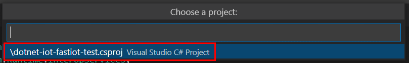
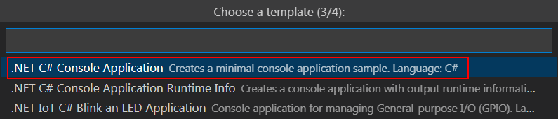
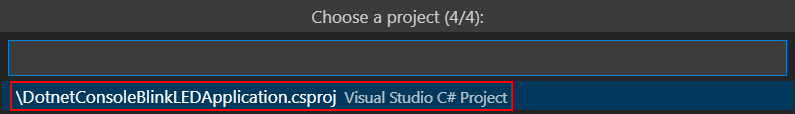
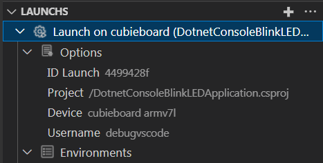

# Additional materials

**Content**

1. [Setting up an existing project for remote debugging](#setting-up-an-existing-project-for-remote-debugging)
2. [Video instructions for setting up extension and remote device](#video-instructions-for-configuring-the-extension-and-remote-device)
3. [Third-party bash-scripts to install packages/libraries](#third-party-bash-scripts-to-install-packageslibraries)
4. [GPIO pin control](#gpio-pin-management)
5. [Manage Device Tree overlays](#manage-device-tree-overlays)
6. [How the extension works](#how-the-extension-works)
7. [About Armbian](#about-the-armbian-distribution)
 
## Setting up an existing project for remote debugging

1. Launch configuration for remote debugging can be added to projects outside of creating the project itself from an extension template. To add Launch, you need to open the project and click on the *Add Launch* button:

2. Select a device for remote debugging:

3. Select a project template from which Launch and Tasks will be taken:

4. Select a project:

5. Created a Launch configuration to launch the application:

6. Next, go to the Activity Bar `Run and Debug`, select the added Launch and run the application:

## Video instructions for configuring the extension and remote device

To simplify the configuration of the extension and the remote device, video clips (YouTube) were created:

1. [Step 1. Configuring SSH access](https://www.youtube.com/watch?v=-xgAP1qsVsw "Step 1. Configuring SSH access");
2. [Step 2. Adding a device](https://www.youtube.com/watch?v=pusO7PV4NL4 "Step 2. Adding a device");
3. [Step 3. Installing packages](https://www.youtube.com/watch?v=Y8U2V0THQh4 "Step 3. Installing packages");
4. [Step 4. Creating a .NET console application and remote debugging](https://www.youtube.com/watch?v=oghH3oHIZgE "Step 4. Creating a .NET console application and remote debugging");
5. [Step 5. Using GPIO. Blink](https://www.youtube.com/watch?v=NQTgP4jwZPg "Step 5. Using GPIO. Blink").

## Third party bash scripts to install packages/libraries

[.NET SDK](https://dot.net/v1/dotnet-install.sh ".NET SDK"), [.NET Runtimes](https://dot.net/v1/dotnet-install.sh " .NET Runtimes"), [.NET Debugger (vsdbg)](https://aka.ms/getvsdbgsh ".NET Debugger (vsdbg)"), Libgpiod, [Docker](https://get.docker.com/ "Docker") are downloaded from the official websites of package developers, with the exception of the Libgpiod library. The script for installing this library is downloaded from the GitHub resource - [devdotnetorg/docker-libgpiod](https://raw.githubusercontent.com/devdotnetorg/docker-libgpiod/master/setup-libgpiod.sh "devdotnetorg/docker-libgpiod"). Next, the downloaded script downloads the source code of the library from the official [Libgpiod] repository (https://git.kernel.org/pub/scm/libs/libgpiod/libgpiod.git/ "Libgpiod") and compiles the library.
       
## GPIO pin management

GPIO (general-purpose input/output) is a general purpose input/output interface. GPIOs are connected directly to the "processor" SoC (System-on-a-Chip - System on a chip). Most single board computers, in addition to the usual bidirectional Input / Output ports, have one or more interfaces: UART, SPI, I²C / TWI, PWM (PWM), but do not have ADC (ADC). GPIO - ports can usually be configured for input or output (Input / Output), the default state is usually INPUT. The following are connected to the GPIO ports: LEDs, buttons, relays, temperature and other sensors, various peripheral devices.

There are several ways to access GPIO programming:

- Via file device (sysfs) GPIO;
- Through direct access to the registers of the chip;
- Using ready-made libraries (libgpiod).

The extension provides for working with GPIO using the Libgpiod library. What is GPIO and how to manage pins using the Libgpiod library in publications:

- [Working with GPIO on the example of Banana Pi BPI-M64. Part 1. Interface sysfs LED and DS18B20] ds18b20/);
- [Working with GPIO in Linux. Part 6. Libgpiod Library](https://devdotnet.org/post/rabota-s-gpio-v-linux-chast-6-biblioteka-libgpiod/);
- [Manage GPIO pins from C# .NET 5 on Linux on Banana Pi M64 (ARM64) and Cubietruck (ARM32) single board computer](https://devdotnet.org/post/upravlyaem-gpio-iz-csharp-net-5- v-linux-na-banana-pi-m64-arm64-i-cubietruck-arm32/);
- [.NET IoT. Part 2. Blinking an LED using the Libgpiod library](https://devdotnet.org/post/dotnet-iot-chast-2-blink-led-using-library-libgpiod/).

## Manage Device Tree overlays

Device Tree overlays are used to enable/disable devices such as I2C, SPI, PWM, etc. Remote loading of `*.DTS` files and enabling/disabling "layers" is available. More details in the publication [Working with GPIO. Part 2. Device Tree overlays](https://devdotnet.org/post/rabota-s-gpio-na-primere-banana-pi-bpi-m64-chast-2-device-tree-overlays/ "Working with GPIO . Part 2. Device Tree overlays"). Working with DTS is only supported in the [Armbian] distribution (https://devdotnet.org/post/armbian-linux-distributiv-dlya-otladochnyh-plat-na-arm/ "Armbian"). To support other distributions, you need to implement the adapter using the interface [IDtoAdapter.ts](https://github.com/devdotnetorg/vscode-extension-dotnet-fastiot/blob/master/src/DTO/IDtoAdapter.ts "IDtoAdapter.ts") . An example implementation for Armbian is [IoTDTOArmbianAdapter.ts](https://github.com/devdotnetorg/vscode-extension-dotnet-fastiot/blob/master/src/DTO/IoTDTOArmbianAdapter.ts "IoTDTOArmbianAdapter.ts").

## How the extension works

The principle of operation of the extension and the internal mechanism are disclosed in publications:

- [Remote debugging of a .NET 5.0 application in Visual Studio Code for ARM using Banana Pi BPI-M64 and Cubietruck (Armbian, Linux) as an example](https://devdotnet.org/post/udalennaya-otladka-net50-visual-studio -code-dlya-arm-banana-pi-bpi-m64-i-cubietruck-armbian-linux/);
- [Simple development of IoT applications in C# for Raspberry Pi and other single-board devices, on Linux](https://devdotnet.org/post/simple-razrabotka-iot-app-na-csharp-dlya-raspberry-pi-i-drugih -sbc-na-linux/).

## About the Armbian distribution
   
[Armbian](https://www.armbian.com/ "Armbian - Linux for ARM development boards") is the most popular distribution for ARM and RISC-V single board computers. More information about Armbian can be found on the page [Armbian - Linux distribution for development boards on ARM](https://devdotnet.org/post/armbian-linux-distributiv-dlya-otladochnyh-plat-na-arm/ "Armbian - Linux distribution kit for debug boards on ARM").