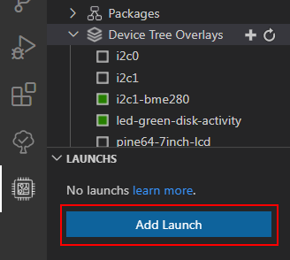
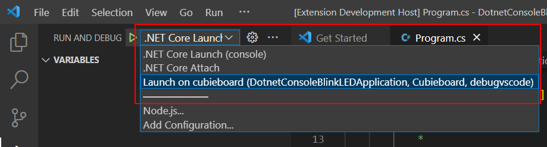

# Дополнительные материалы

**Содержание**

1. [Настройка уже существующего проекта для удаленной отладки](#%D0%BD%D0%B0%D1%81%D1%82%D1%80%D0%BE%D0%B9%D0%BA%D0%B0-%D1%83%D0%B6%D0%B5-%D1%81%D1%83%D1%89%D0%B5%D1%81%D1%82%D0%B2%D1%83%D1%8E%D1%89%D0%B5%D0%B3%D0%BE-%D0%BF%D1%80%D0%BE%D0%B5%D0%BA%D1%82%D0%B0-%D0%B4%D0%BB%D1%8F-%D1%83%D0%B4%D0%B0%D0%BB%D0%B5%D0%BD%D0%BD%D0%BE%D0%B9-%D0%BE%D1%82%D0%BB%D0%B0%D0%B4%D0%BA%D0%B8);
2. Видео-инструкции для настройки расширения и удаленного устройства;
3. Сторонние bash-скрипты для установки пакетов/библиотек;
4. Управление контактами GPIO;
5. Управление файлами наложения устройств (Device Tree overlays);
6. Как работает расширение;
7. Об дистрибутиве Armbian.
 
## Настройка уже существующего проекта для удаленной отладки

1. Конфигурацию Launch для удаленной отладки можно добавлять проектам вне создания самого проекта из шаблона расширения. Для добавления Launch необходимо открыть проект и нажать на кнопку *Add Launch*:

2. Выбрать устройство для удаленной отладки:

3. Выбрать шаблон проекта из которго будут взяты Launch и Tasks:

4. Выбрать проект:

5. Создана конфигурация Launch для запуска приложения:

6. Далее переходим в Activity Bar `Run and Debug`, выбираем созданный Launch и запускаем приложение:

## Видео-инструкции для настройки расширения и удаленного устройства

Для упрощения настроки расширения и удаленного устройства был создан ряд видео-роликов (YouTube):

1. [Step 1. Configuring SSH access](https://www.youtube.com/watch?v=-xgAP1qsVsw "Step 1. Configuring SSH access");
2. [Step 2. Adding a device](https://www.youtube.com/watch?v=pusO7PV4NL4 "Step 2. Adding a device");
3. [Step 3. Installing packages](https://www.youtube.com/watch?v=Y8U2V0THQh4 "Step 3. Installing packages");
4. [Step 4. Creating a .NET console application and remote debugging](https://www.youtube.com/watch?v=oghH3oHIZgE "Step 4. Creating a .NET console application and remote debugging");
5. [Step 5. Using GPIO. Blink](https://www.youtube.com/watch?v=NQTgP4jwZPg "Step 5. Using GPIO. Blink").

## Сторонние bash-скрипты для установки пакетов/библиотек

[.NET SDK](https://dot.net/v1/dotnet-install.sh ".NET SDK"), [.NET Runtimes](https://dot.net/v1/dotnet-install.sh ".NET Runtimes"), [.NET Debugger (vsdbg)](https://aka.ms/getvsdbgsh ".NET Debugger (vsdbg)"), Libgpiod, [Docker](https://get.docker.com/ "Docker"), загружаются с официальных сайтов разработчиков пакетов, за исключением библиотеки Libgpiod. Скрипт для установки данной библиотеки загружается с ресурса GitHub — [devdotnetorg/docker-libgpiod](https://raw.githubusercontent.com/devdotnetorg/docker-libgpiod/master/setup-libgpiod.sh "devdotnetorg/docker-libgpiod"). Далее, загруженный скрипт скачивает исходный текст библиотеки с официального репозитория [Libgpiod](https://git.kernel.org/pub/scm/libs/libgpiod/libgpiod.git/ "Libgpiod") и выполняется компиляция библиотеки.
       
## Управление контактами GPIO

GPIO (general-purpose input/output) — интерфейс ввода/вывода общего назначения. GPIO подключены напрямую к «процессору» SoC (System-on-a-Chip — Система на кристалле). Большинство одноплатных компьютеров, кроме обычных двунаправленных Input/Output портов, имеют один или более интерфейсов: UART, SPI, I²C/TWI, PWM (ШИМ), но не имеют ADC (АЦП). GPIO — порты обычно могут быть сконфигурированны на ввод или вывод (Input/Output), состояние по умолчанию обычно INPUT. К портам GPIO подключаются: светодиоды, кнопки, реле, температурные и другие датчики, различные периферийные устройства.

Для программирования GPIO существует несколько способов обращения:

- Посредством файл-устройства (sysfs) GPIO;
- Через прямое обращение к регистрам чипа;
- Используя уже готовые библиотеки (libgpiod).

Расширение предусматривает работу с GPIO используя библиотеку Libgpiod. Что такое GPIO и как управлять контактами используя библиотеку Libgpiod в публикациях:

- [Работа с GPIO на примере Banana Pi BPI-M64. Часть 1. Интерфейс sysfs LED и DS18B20](https://devdotnet.org/post/rabota-s-gpio-na-primere-banana-pi-bpi-m64-chast-1-interfejs-sysfs-led-i-ds18b20/);
- [Работа с GPIO в Linux. Часть 6. Библиотека Libgpiod](https://devdotnet.org/post/rabota-s-gpio-v-linux-chast-6-biblioteka-libgpiod/);
- [Управляем контактами GPIO из C# .NET 5 в Linux на одноплатном компьютере Banana Pi M64 (ARM64) и Cubietruck (ARM32)](https://devdotnet.org/post/upravlyaem-gpio-iz-csharp-net-5-v-linux-na-banana-pi-m64-arm64-i-cubietruck-arm32/);
- [.NET IoT. Часть 2. Мигаем светодиодом (LED) используя библиотеку Libgpiod](https://devdotnet.org/post/dotnet-iot-chast-2-blink-led-using-library-libgpiod/).

## Управление файлами наложения устройств (Device Tree overlays)

Device Tree overlays используются для включения/выключения таких устройства как I2C, SPI, PWM, и т. д. Доступна удаленная загрузка файлов `*.DTS` и включение/выключение «слоев». Более подробно в публикации [Работа с GPIO. Часть 2. Device Tree overlays](https://devdotnet.org/post/rabota-s-gpio-na-primere-banana-pi-bpi-m64-chast-2-device-tree-overlays/ "Работа с GPIO. Часть 2. Device Tree overlays"). Работа с DTS поддерживается только в дистрибутиве [Armbian](https://devdotnet.org/post/armbian-linux-distributiv-dlya-otladochnyh-plat-na-arm/ "Armbian"). Для поддержки других дистрибутивов необходима реализация адаптера по интерфейсу [IDtoAdapter.ts](https://github.com/devdotnetorg/vscode-extension-dotnet-fastiot/blob/master/src/DTO/IDtoAdapter.ts "IDtoAdapter.ts"). Пример реализации для Armbian — [IoTDTOArmbianAdapter.ts](https://github.com/devdotnetorg/vscode-extension-dotnet-fastiot/blob/master/src/DTO/IoTDTOArmbianAdapter.ts "IoTDTOArmbianAdapter.ts").

## Как работает расширение

Принцип работы расширения и внутренний механизм раскрывается в публикациях:

- [Удаленная отладка приложения на .NET 5.0 в Visual Studio Code для ARM на примере Banana Pi BPI-M64 и Cubietruck (Armbian, Linux)](https://devdotnet.org/post/udalennaya-otladka-net50-visual-studio-code-dlya-arm-banana-pi-bpi-m64-i-cubietruck-armbian-linux/);
- [Простая разработка IoT приложений на C# для Raspberry Pi и других одноплатников, на Linux](https://devdotnet.org/post/simple-razrabotka-iot-app-na-csharp-dlya-raspberry-pi-i-drugih-sbc-na-linux/).

## Об дистрибутиве Armbian
   
[Armbian](https://www.armbian.com/ "Armbian – Linux for ARM development boards") это самый популярный дистрибутив для одноплатных компьютеров на архитектуре ARM и RISC-V. Более подробно об Armbian можно ознакомится на странице [Armbian — Linux дистрибутив для отладочных плат на ARM](https://devdotnet.org/post/armbian-linux-distributiv-dlya-otladochnyh-plat-na-arm/ "Armbian — Linux дистрибутив для отладочных плат на ARM").
