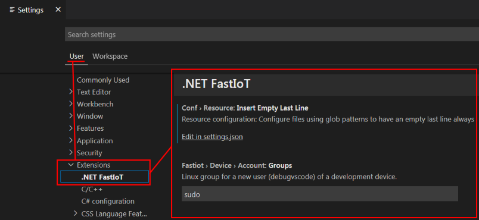

# Extension settings

To change the extension settings, open the menu item `File > Preferences > Settings`. Then go to the `User` tab and select `Extensions`.

Settings:

- **Fastiot › Device › Account: Groups** - Linux user group on a remote device (eg Raspberry Pi) to which an account (`debugvscode`) will be added to manage the device. This group must have Administrator rights. Default value: `sudo`.
- **Fastiot › Device › Account: Username** - account name, created on the remote device. Used to control the device and perform remote debugging. Default value: `debugvscode`.
- **Fastiot › Device › All: JSON** - device settings in JSON format, it is not recommended to change them manually. Due to incorrect changes, the device list may not load.
- **Fastiot › Device: Applicationdatafolder** - a shared folder for storing access keys to devices (for example, Raspberry Pi), templates, extension settings. Default value: `%userprofile%\fastiot`. Example: `C:\Users\Anton\fastiot`.
- **Fastiot › Device > ssh > Key: Bits** - key length in bits. Default value: `256`.
- **Fastiot › Device > ssh > Key: Type** - The name of the algorithm used to generate the key. For more information about key algorithms, see [How To Set Up SSH Keys](https://goteleport.com/blog/how-to-set-up-ssh-keys/). Default value: `ed25519`. If you choose the `rsa` algorithm, then you will need to add the line `PubkeyAcceptedAlgorithms=+ssh-rsa` to the `/etc/ssh/sshd_config` file.
- **Fastiot › Launch: Templatetitle** - template for forming the name of Launch. Variable values can be viewed at [link](Launch-title-template.md "Template for forming the name Launch"). Default value: `Launch on %{device.label} (%{project.name}, %{device.board.name}, %{device.user.debug})`.
- **Fastiot › Template: Isupdate** - enable/disable updating templates from Internet resources.
- **Fastiot › Template: Lastupdate** - last update time. Technical parameter.
- **Fastiot › Template: Loadonstart** - loading templates at extension start. If this option is disabled, templates will only be loaded the first time they are accessed.
- **Fastiot › Template: Updateinterval** - template update interval in hours.
