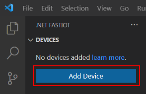

# Getting started

### Step 1 — Preparing the device

The single board computer must be running a Debian or Ubuntu, Linux distribution. For remote access, you need to install the [OpenSSH](https://ubuntu.com/server/docs/service-openssh "Service - OpenSSH Ubuntu") server and set certain settings. You can use [MobaXterm](https://mobaxterm.mobatek.net/download.html "MobaXterm Xserver with SSH, telnet, RDP, VNC and X11") as a remote access terminal. All subsequent steps are performed on a single-board computer.

1. If the `sudo` package is not installed, then install this package as the `root` user using the commands:

```bash
apt-get update
apt-get install -y sudo
```

2. To install the OpenSSH server and configure access, run the following commands:

```bash
sudo apt-get update
sudo apt-get install -y openssh-server mc
sudo mcedit /etc/ssh/sshd_config
```

3. In the opened editor, set the following parameters:

```bash
PermitRootLogin yes
PasswordAuthentication yes
```

The remaining necessary parameters will be added automatically when you first connect to the device using the extension.

4. Then save the changes <kbd>F2</kbd> and exit the editor <kbd>F10</kbd>.

5. Restart the OpenSSH server to apply the new settings:

```bash
sudo systemctl reload ssh
sudo systemctl status ssh
```

The last command displays the current status of the service.

### Step 2 - Adding a Device

*Add device*



All settings, including private keys, templates, are by default located in the user profile folder along the path `%userprofile%\fastiot` (the location can be changed in the settings). When you connect to the device for the first time, a pair of keys is created: private and public. The private key is copied to the `%userprofile%\fastiot\settings\keys` folder and used to configure the device and start remote debugging, the public key is stored on the remote device itself.

The important point is to select an account to create on the device that will be used for device management and remote debugging. The first option is the **debugvscode** account (the name can be changed in the settings), the second option is **root**:

*Selecting an account to create on the device*


Selecting the **debugvscode** option creates a configuration file for device access rights [20-gpio-fastiot.rules](/linux/config/20-gpio-fastiot.rules "20-gpio-fastiot.rules") using the [ udev](https://ru.wikipedia.org/wiki/Udev "udev"). A group named **iot** is created and the user **debugvscode** is added to it. The **iot** group is then given permissions to gpiochip, led, and pwm. Further, to access other hardware interfaces, the user **debugvscode** is added to the appropriate groups with access such as: video, i2c, spi, spidev, kmem, tty, dialout, input, audio, to access I2C, SPI, etc. d.

Due to the fact that testing was performed only on [Armbian](https://www.armbian.com/ "Armbian - Linux for ARM development boards"), not all permissions may have been added. Therefore, if there are problems with access rights to gpiochip, PWM, etc., then choose - ** root **.

### Step 3 - Install Packages

To run a .NET IoT application and perform remote debugging, you need to install:

- Runtime - .NET Runtime;
- Remote debugger - .NET Debugger (vsdbg).

*Minimum set of packages to run .NET applications*


### Step 4 - Create a Project

1. Now you need to create a project. To create a project, click on the *Create project* button:


2. Select a device for remote debugging:


3. Select a template for the project:


4. Set the name of the project:


5. Specify the folder for saving the project:


6. Select version of .NET framework:


7. Available Launch to launch remote debugging:


8. Now go to `Run and Debug`:


9. Select the Launch configuration to launch:


10. Run the project for debugging menu `Run > Start Debugging`:


11. An example of displaying messages during remote debugging:


Sample projects with added configuration Launch (`/.vscode/launch.json`) and Tasks (`/.vscode/tasks.json`) are located in the [samples](/samples/) folder.

The `template.fastiot.yaml` file will be placed in the project folder. This file is required to determine the template ID when adding Launch. If it is removed, then there will be no exact definition of the template from which the project was formed. From the `template.fastiot.yaml` file, only the template identifier string `id: dotnet-console` is taken.

## Rebuild Launch

Launch (`/.vscode/launch.json`) and Tasks (`/.vscode/tasks.json`) configurations contain absolute paths to binary files that are loaded on the device, for example `/cygdrive/d/Anton/Projects/Tests /DotnetConsoleAppRuntimeInfo/bin/Debug/net5.0/linux-arm/`. In this regard, if you change the path to the `Applicationdatafolder` folder in the settings or rename / move the project folder, then the paths become non-existent. In this case, you need to rebuild (Rebuild) Launch. Select the required Launch and then call the context menu, click on the `Rebuild` menu item.

*Invoking the Rebuild command*


## Launch Options

Some Launch options can be changed from the LAUCHS window. The following options are changed:

- **Console (terminal)** - controls what console (terminal) window the target app is launched into. Default value: `internalConsole`. More details [Console (terminal) window](https://github.com/OmniSharp/omnisharp-vscode/blob/master/debugger-launchjson.md#console-terminal-window);
- **Just My Code** - debug just my code. Default value: `true`. Learn more [How to disable the “Just My Code” setting on the VS Code debugger](https://medium.com/@thiagoalves/how-to-disable-the-just-my-code-setting-on-the -vs-code-debugger-f5fd774e0af8);