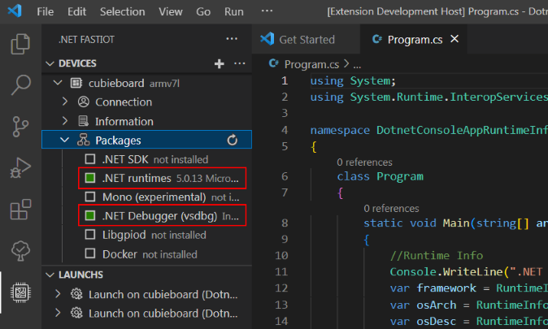
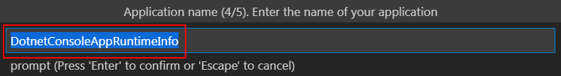
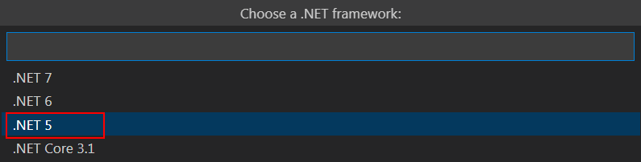
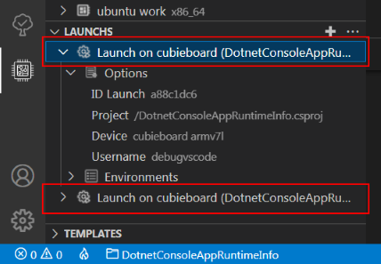
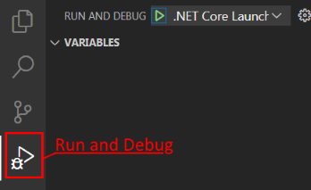
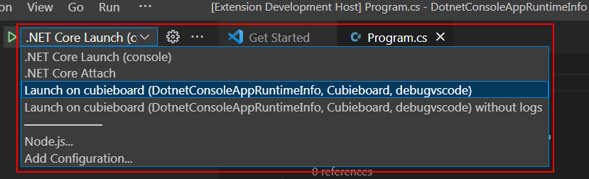

# Быстрый старт

### Шаг 1 — Подготовка устройства

Одноплатный компьютер должен работать под управлением дистрибутива Debian или Ubuntu, Linux. Для удаленного доступа необходимо установить [OpenSSH](https://ubuntu.com/server/docs/service-openssh "Service - OpenSSH Ubuntu") сервер и задать определенные настройки. В качестве терминала для удаленного доступа можно использовать [MobaXterm](https://mobaxterm.mobatek.net/download.html "MobaXterm Xserver with SSH, telnet, RDP, VNC and X11"). Все последующие действия выполняются на одноплатном компьютере.

1. Если пакет `sudo` не установлен, то установите данный пакет от имени пользователя `root`, с помощью команд:

```bash
apt-get update
apt-get install -y sudo
```

2. Для установки OpenSSH сервера и настройки доступа выполните следующие команды:

```bash
sudo apt-get update
sudo apt-get install -y openssh-server mc
sudo systemctl reload ssh
sudo systemctl status ssh
sudo mcedit /etc/ssh/sshd_config
```

3. В открывшемся редакторе задайте следующие параметры:

```bash
PermitRootLogin yes
PasswordAuthentication yes
```

Остальные необходимые параметры добавятся автоматически при первом подключении к устройству, используя расширение.

4. Затем сохраните изменения <kbd>F2</kbd> и выйдите  из редактора <kbd>F10</kbd>.

5. Перезапустите OpenSSH сервер для применения новых настроек:

```bash
sudo systemctl reload ssh
sudo systemctl status ssh
```

Последняя команда выводит текущий статус службы.

### Шаг 2 — Добавление устройства

*Добавление устройства*


Все настройки, включая приватные ключи, шаблоны, по умолчанию располагаются в папке профиля пользователя по пути `%userprofile%\fastiot` (расположение можно изменить в настройках). При первом подключении к устройству создается пара ключей: приватный и публичный. Приватный ключ копируется в папку `%userprofile%\fastiot\settings\keys` и используется для конфигурирования устройства и запуска удаленной отладки, публичный ключ хранится на самом удаленном устройстве.

Важный момент заключается в выборе учетной записи для создания на устройстве, которая будет использоваться для управления устройством и удаленной отладки. Первый вариант это учетная запись **debugvscode** (название можно изменить в настройках), второй вариант это **root**:

*Выбор учетной записи для создания на устройстве*


При выборе варианта **debugvscode** создаетcя файл настройки прав доступа [20-gpio-fastiot.rules](/linux/config/20-gpio-fastiot.rules "20-gpio-fastiot.rules") к устройствам используя подсистему [udev](https://ru.wikipedia.org/wiki/Udev "udev"). Создается группа с названием **iot**, и в нее добавляется пользователь **debugvscode**. Затем группе **iot** выдаются права доступа к gpiochip, led и pwm. Далее для доступа к другим аппаратным интерфесам пользователь **debugvscode** добавляется в соответствующие группы с доступом такие как: video, i2c, spi, spidev, kmem, tty, dialout, input, audio, для доступа к I2C, SPI, и т.д. 

В связи с тем, что тестирование выполнялось только на [Armbian](https://www.armbian.com/ "Armbian – Linux for ARM development boards"), возможно не все права доступа были добавлены. Поэтому, если возникнут проблемы с правами доступа к gpiochip, PWM и т.д., то выбирайте — **root**.

### Шаг 3 — Установка пакетов

Для запуска .NET IoT приложения и выполнения удаленной отладки необходимо установить:

- Среду исполнения - .NET Runtime;
- Удаленный отладчик - .NET Debugger (vsdbg).

*Минимальный набор пакетов для запуска .NET приложений*



### Шаг 4 — Создание проекта

1. Теперь необходимо создать проект. Для создания проекта необходимо нажать на кнопку *Create project*:


2. Выбрать устройство для удаленной отладки:


3. Выбрать шаблон для проекта:


4. Задать название проекта:



5. Указать папку сохранения проекта:


6. Выбрать версию .NET framework:



7. Доступные Launch для запуска удаленной отладки:



8. Теперь переходим в `Run and Debug`:



9. Выбираем конфигурацию Launch для запуска:



10. Запускаем проект на отладку меню `Run > Start Debugging`:


11. Пример вывода сообщений при удаленной отладки:


Примеры проектов с добавленной конфигурацией Launch (`/.vscode/launch.json`) и Tasks (`/.vscode/tasks.json`) располагаются в папке [samples](/samples/).

В папке с проектом будет размещен файл `template.fastiot.yaml`. Этот файл необходим для определения идентификатора шаблона при добавлении Launch. Если его удалить, то не будет точного определения шаблона из которого был сформирован проект. Из файла `template.fastiot.yaml` берется только строка идентификатор шаблона `id: dotnet-console`.

## Перестройка (Rebuild) Launch

Конфигурации Launch (`/.vscode/launch.json`) и Tasks (`/.vscode/tasks.json`) содержат абсолютные пути к бинарным файлам, которые загружаются на устройство, например `/cygdrive/d/Anton/Projects/Tests/DotnetConsoleAppRuntimeInfo/bin/Debug/net5.0/linux-arm/`. В связи с этим, если вы изменяете путь к папке `Applicationdatafolder` в настройках или переименовываете/перемещаете папку с проектом, то пути становятся несуществующими. В этом случае необходимо перестроить (Rebuild) Launch. Выбрать необходимый Launch и затем вызвать контекстное меню, нажать на пункт меню `Rebuild`.

*Вызов команды Rebuild*


